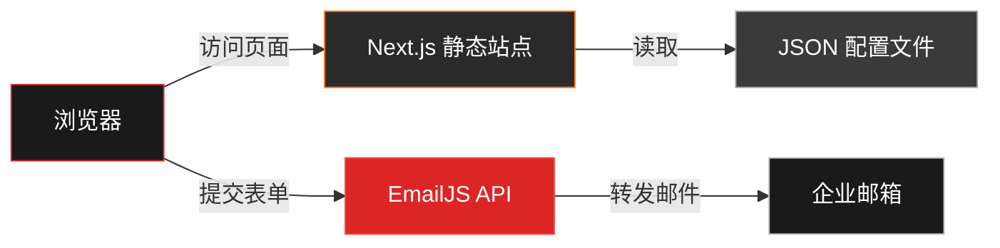
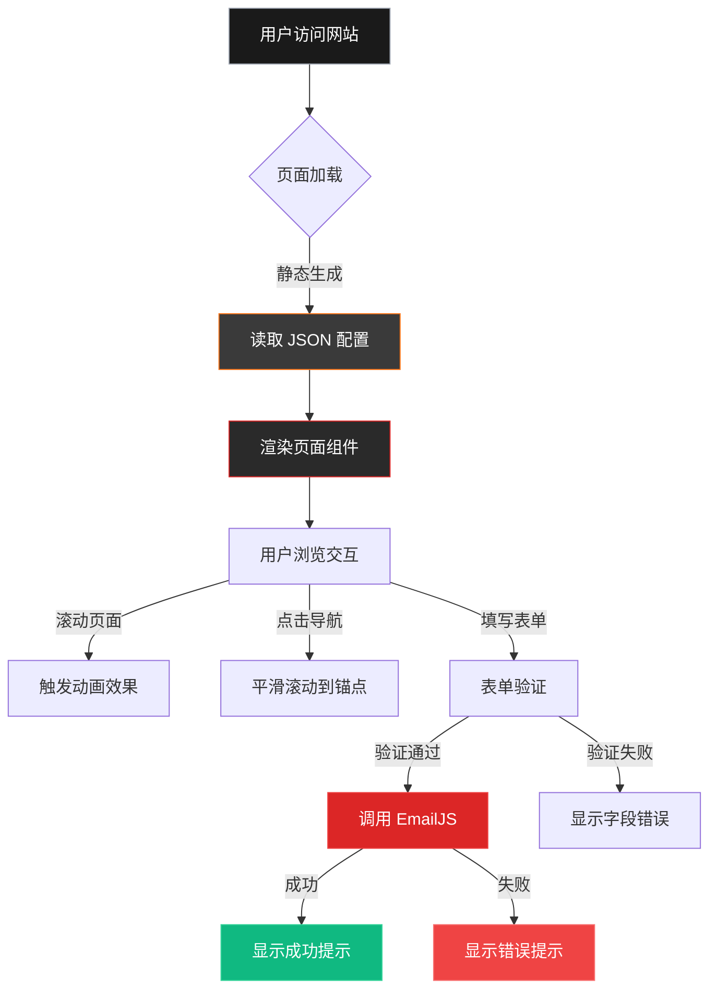

## 产品概述

为广州引领者汽车用品有限公司打造现代化暗黑风格品牌官网，采用单页响应式设计，展示企业品牌形象、产品系列和合作咨询入口。网站定位语为"一键匹配爱车的每个细节"，体现专业、高端、现代的品牌调性。

## 核心功能

- **Hero Banner 全屏展示**：首屏大图配合品牌Slogan，视差滚动效果，营造视觉冲击
- **核心优势展示**：3-4个企业核心特点卡片，突出品质保障和专业实力
- **明星产品系列**：3-6款主打产品网格展示，支持图片、名称、特性描述，悬停交互效果
- **效果展示画廊**：汽车用品实际安装效果图展示，支持图片瀑布流或轮播展示
- **品牌价值观**：企业介绍、发展理念和服务承诺
- **合作咨询表单**：在线提交合作需求，通过EmailJS发送至企业邮箱
- **响应式导航**：锚点导航支持平滑滚动，移动端汉堡菜单

## 技术栈选型

- **前端框架**：Next.js 14 (App Router) + React 18 + TypeScript
- **样式方案**：Tailwind CSS（暗黑主题定制）+ CSS Variables
- **动画库**：Framer Motion（视差滚动、淡入动画、悬停效果）
- **邮件服务**：EmailJS（纯前端邮件发送，无需后端接口）
- **图标库**：Lucide React（现代化矢量图标）
- **部署方式**：静态导出（next export）部署至传统服务器

## 系统架构

### 整体架构模式

采用 Next.js 静态站点生成（SSG）架构，所有数据通过静态 JSON 配置文件管理，无需后端服务器和数据库。邮件提交通过 EmailJS 直接从浏览器发送至企业邮箱。



### 模块划分

#### UI 组件模块

- **职责**：页面级组件（Hero、Products、Showcase、About、Footer）和可复用 UI 组件（Button、Card、Form、Navigation）
- **技术**：React + TypeScript + Tailwind CSS + Framer Motion
- **依赖**：Lucide React（图标）、Framer Motion（动画）
- **接口**：导出 React 组件，接收 props 配置

#### 数据配置模块

- **职责**：集中管理网站内容数据（产品列表、特性说明、公司信息）
- **技术**：TypeScript 接口定义 + JSON 数据文件
- **依赖**：无外部依赖
- **接口**：导出类型安全的数据对象

#### 邮件服务模块

- **职责**：处理合作咨询表单提交和邮件发送
- **技术**：EmailJS SDK + TypeScript
- **依赖**：EmailJS 外部服务
- **接口**：sendEmail 异步函数，接收表单数据返回发送结果

#### 动画效果模块

- **职责**：视差滚动、淡入动画、平滑滚动锚点跳转
- **技术**：Framer Motion + React Hooks
- **依赖**：Framer Motion 库
- **接口**：导出动画组件和自定义 Hooks

### 数据流设计



## 实现细节

### 核心目录结构

```
website/
├── app/
│   ├── layout.tsx              # 根布局（全局样式、字体、元数据）
│   ├── page.tsx                # 首页（单页应用入口）
│   └── globals.css             # Tailwind 指令和全局样式变量
├── components/
│   ├── sections/               # 页面区块组件
│   │   ├── HeroSection.tsx     # Hero Banner 区块
│   │   ├── FeaturesSection.tsx # 核心优势区块
│   │   ├── ProductsSection.tsx # 产品展示区块
│   │   ├── ShowcaseSection.tsx # 效果展示区块
│   │   ├── AboutSection.tsx    # 关于我们区块
│   │   └── ContactSection.tsx  # 合作表单区块
│   ├── ui/                     # 可复用 UI 组件
│   │   ├── Navigation.tsx      # 导航栏组件
│   │   ├── Button.tsx          # 按钮组件
│   │   ├── Card.tsx            # 卡片组件
│   │   ├── Input.tsx           # 表单输入组件
│   │   └── Footer.tsx          # 页脚组件
│   └── animations/             # 动画组件
│       ├── ParallaxBanner.tsx  # 视差滚动容器
│       └── FadeInView.tsx      # 淡入动画容器
├── lib/
│   ├── email.ts                # EmailJS 集成逻辑
│   ├── data.ts                 # 数据导出模块
│   └── types.ts                # TypeScript 类型定义
├── config/
│   └── site-data.json          # 网站内容配置文件
└── public/
    └── images/                 # 图片资源目录
```

### 关键代码结构

**SiteConfig 接口**：定义网站配置数据的类型结构，包含品牌信息、导航菜单、产品列表、特性说明和公司介绍。确保配置文件与代码的类型安全和自动补全。

```typescript
// lib/types.ts - 核心数据类型定义
interface SiteConfig {
  brand: {
    name: string;
    slogan: string;
    logo: string;
  };
  navigation: Array<{ label: string; href: string }>;
  hero: {
    title: string;
    subtitle: string;
    backgroundImage: string;
  };
  features: Array<{
    icon: string;
    title: string;
    description: string;
  }>;
  products: Array<{
    id: string;
    name: string;
    category: string;
    image: string;
    features: string[];
  }>;
  showcase: Array<{
    id: string;
    image: string;
    caption: string;
  }>;
  about: {
    company: string;
    description: string;
    values: string[];
  };
}
```

**EmailService 类**：封装 EmailJS 邮件发送逻辑，提供类型安全的表单数据发送接口。处理发送成功、失败和网络错误场景，返回统一的结果格式。

```typescript
// lib/email.ts - EmailJS 服务封装
import emailjs from '@emailjs/browser';

interface ContactFormData {
  name: string;
  company: string;
  phone: string;
  email: string;
  message: string;
}

class EmailService {
  private serviceId: string;
  private templateId: string;
  private publicKey: string;

  constructor() {
    this.serviceId = process.env.NEXT_PUBLIC_EMAILJS_SERVICE_ID!;
    this.templateId = process.env.NEXT_PUBLIC_EMAILJS_TEMPLATE_ID!;
    this.publicKey = process.env.NEXT_PUBLIC_EMAILJS_PUBLIC_KEY!;
  }

  async sendContactForm(data: ContactFormData): Promise<{ success: boolean; message: string }> {
    try {
      await emailjs.send(this.serviceId, this.templateId, data, this.publicKey);
      return { success: true, message: '提交成功，我们会尽快联系您' };
    } catch (error) {
      return { success: false, message: '提交失败，请稍后重试' };
    }
  }
}
```

### 技术实现方案

#### 1. 暗黑主题色彩系统

**问题**：实现深空黑背景 + 奢侈橙强调色的暗黑主题，确保全局颜色一致性和可维护性。

**解决方案**：通过 Tailwind CSS 配置扩展色彩系统，使用 CSS Variables 管理主题色，支持快速调整和全局替换。

**关键技术**：Tailwind CSS 配置、CSS Variables、暗黑主题最佳实践

**实现步骤**：

1. 在 `tailwind.config.ts` 中扩展色彩系统，定义 `luxury-orange`、`space-black`、`metal-silver` 等自定义颜色
2. 在 `globals.css` 中定义 CSS Variables，映射到 Tailwind 颜色值
3. 为文本、背景、边框设置默认暗黑主题样式，确保对比度符合 WCAG 标准
4. 使用 Tailwind 类名应用颜色（如 `bg-space-black`、`text-luxury-orange`）
5. 验证不同设备和浏览器的颜色显示一致性

**测试策略**：在不同浏览器和设备上检查色彩对比度、可读性和视觉一致性

#### 2. 视差滚动和动画效果

**问题**：实现 Hero Banner 视差滚动、模块淡入动画、悬停效果等流畅动画，提升用户体验。

**解决方案**：使用 Framer Motion 构建动画组件，结合 Intersection Observer API 实现滚动触发动画，确保性能优化。

**关键技术**：Framer Motion、Intersection Observer API、CSS Transform、requestAnimationFrame

**实现步骤**：

1. 封装 `ParallaxBanner` 组件，监听滚动事件计算视差偏移量
2. 创建 `FadeInView` 组件，使用 Intersection Observer 检测元素进入视口
3. 为产品卡片添加 Framer Motion 的 `whileHover` 动画配置（缩放、阴影）
4. 实现平滑滚动锚点跳转（`scroll-behavior: smooth` 或 JS 实现）
5. 优化动画性能：使用 `will-change`、避免 layout thrashing、节流滚动事件

**测试策略**：测试不同设备的动画流畅度，确保 60fps 渲染，检查移动端性能

#### 3. EmailJS 表单集成

**问题**：在纯前端环境下实现合作咨询表单提交和邮件发送功能，无需后端服务器。

**解决方案**：集成 EmailJS 服务，配置邮件模板和服务密钥，实现表单验证和错误处理。

**关键技术**：EmailJS SDK、React Hook Form（表单验证）、环境变量管理

**实现步骤**：

1. 注册 EmailJS 账号，创建邮件服务和模板，获取 Service ID、Template ID、Public Key
2. 在项目根目录创建 `.env.local` 文件，存储 EmailJS 配置（不提交到版本控制）
3. 使用 React Hook Form 实现表单验证（必填字段、邮箱格式、手机号格式）
4. 封装 EmailService 类，处理表单提交和邮件发送逻辑
5. 实现发送状态提示（加载中、成功、失败），优化用户反馈

**测试策略**：测试表单验证规则、邮件发送成功和失败场景、网络超时处理

#### 4. 响应式布局设计

**问题**：适配 Mobile（<640px）、Tablet（640-1024px）、Desktop（>1024px）三种屏幕尺寸，确保各设备良好体验。

**解决方案**：使用 Tailwind CSS 响应式工具类，结合 Flexbox 和 Grid 布局，实现流式布局和断点切换。

**关键技术**：Tailwind CSS 响应式前缀、CSS Grid、Flexbox、媒体查询

**实现步骤**：

1. 定义 Tailwind 断点：`sm`（640px）、`md`（768px）、`lg`（1024px）、`xl`（1280px）
2. 产品网格布局：Mobile 1列、Tablet 2列、Desktop 3-4列（使用 `grid-cols-1 md:grid-cols-2 lg:grid-cols-3`）
3. 导航菜单：Desktop 水平导航、Mobile 汉堡菜单（使用 Framer Motion 实现抽屉动画）
4. 字体大小响应式调整：Hero 标题在 Mobile 缩小 30%，Desktop 使用全尺寸
5. 图片响应式优化：使用 Next.js Image 组件自动生成多尺寸图片

**测试策略**：在真实设备和浏览器开发者工具中测试各断点显示效果

### 集成点说明

#### 外部服务依赖

- **EmailJS**：邮件发送服务，需要配置 Service ID、Template ID 和 Public Key
- **字体服务**：Google Fonts 或本地托管字体文件（推荐使用 Next.js Font Optimization）

#### 数据格式规范

- 配置文件格式：JSON，UTF-8 编码，遵循 `SiteConfig` 接口定义
- 图片路径：相对路径（`/images/products/xxx.jpg`）或绝对 URL
- 邮件模板变量：`{{name}}`、`{{company}}`、`{{phone}}`、`{{email}}`、`{{message}}`

#### 环境变量配置

```
# .env.local
NEXT_PUBLIC_EMAILJS_SERVICE_ID=service_xxxxxxx
NEXT_PUBLIC_EMAILJS_TEMPLATE_ID=template_xxxxxxx
NEXT_PUBLIC_EMAILJS_PUBLIC_KEY=xxxxxxxxxxxxxxx
```

## 技术考量

### 日志记录

- 遵循 Next.js 项目日志约定，使用 `console.log`、`console.error` 记录关键操作
- 邮件发送失败时记录错误详情（不包含敏感信息）
- 生产环境建议集成 Sentry 或类似服务进行错误监控

### 性能优化

- **图片优化**：使用 Next.js Image 组件，自动生成 WebP 格式，lazy loading
- **代码分割**：动态导入非首屏组件（`next/dynamic`），减少初始 bundle 体积
- **字体优化**：使用 `next/font` 自托管字体，避免外部请求阻塞渲染
- **缓存策略**：静态导出启用 CDN 缓存，配置合理的 Cache-Control 头
- **动画性能**：使用 CSS Transform 和 Opacity 实现动画，避免触发 layout 和 paint

### 安全措施

- **环境变量保护**：EmailJS 密钥存储在 `.env.local`，不提交到版本控制
- **表单验证**：前端验证防止无效提交，EmailJS 配置域名白名单防止滥用
- **XSS 防护**：React 自动转义用户输入，避免直接使用 `dangerouslySetInnerHTML`
- **HTTPS 部署**：确保生产环境启用 HTTPS，保护表单数据传输安全

### 可扩展性

- **配置驱动**：所有内容通过 JSON 配置管理，方便非开发人员更新
- **组件化设计**：UI 组件高度复用，易于扩展新页面或区块
- **类型安全**：TypeScript 确保配置文件和代码的类型一致性
- **国际化准备**：数据结构支持扩展多语言字段（未来可集成 i18n）

## 设计风格

采用**暗黑奢华风格**（Luxury Dark Theme），以深空黑为主基调，搭配奢侈橙强调色和金属银点缀色，营造专业、高端、现代的品牌调性。设计灵感来源于高端汽车展厅和奢侈品官网，强调视觉冲击力和细节品质。

## 视觉层次

- **背景层**：深空黑渐变背景（#0A0A0A → #1A1A1A），部分区域使用灰色卡片背景（#2A2A2A、#3A3A3A）制造层次感
- **内容层**：纯白文字（#FFFFFF）作为主要内容，高光灰（#9CA3AF）作为次要文字，确保高对比度和可读性
- **强调层**：奢侈橙（#DC2626 - #F97316 渐变）用于 CTA 按钮、悬停状态和重点信息，金属银（#C0C0C0）用于产品特性图标

## 页面区块设计

### 1. Hero Banner 区块

- **布局**：全屏高度（100vh），居中对齐，视差滚动背景
- **内容**：品牌 Logo（左上角）、主标题"CarYou Pe"（超大字号，奢侈橙渐变色）、副标题"一键匹配爱车的每个细节"（高光灰）、CTA 按钮（"了解产品"，悬停橙色发光效果）
- **动效**：背景图片缓慢向上移动（视差滚动），文字淡入动画（stagger 效果），鼠标滚动提示箭头动画
- **响应式**：Mobile 标题字号减小 40%，按钮改为全宽，背景图适配竖屏

### 2. 核心优势区块

- **布局**：深灰色背景（#1A1A1A），3-4 列网格布局（Mobile 1列，Tablet 2列，Desktop 4列），上下 padding 80px
- **内容**：每个特性卡片包含图标（金属银）、标题（纯白）、描述文字（高光灰），卡片背景半透明（#2A2A2A，80% 不透明度）
- **动效**：卡片进入视口时依次淡入（延迟 100ms），悬停时卡片轻微上浮 + 橙色边框发光
- **响应式**：Mobile 卡片改为垂直堆叠，Tablet 2列布局保持间距一致

### 3. 明星产品展示区块

- **布局**：3列网格布局（Mobile 1列，Tablet 2列，Desktop 3列），产品卡片采用垂直卡片设计，图片占 60% 高度
- **内容**：产品图片（16:9 比例，圆角 8px）、产品名称（纯白，粗体）、产品分类标签（橙色徽章）、特性列表（带图标的列表项）
- **动效**：卡片悬停时图片缩放 105% + 阴影增强，特性列表逐项淡入，底部"查看详情"按钮从透明变为橙色
- **响应式**：Mobile 卡片图片改为 4:3 比例，文字大小适配小屏

### 4. 效果展示区块

- **布局**：瀑布流布局或轮播展示，深色背景（#0A0A0A），图片间距 16px，支持点击放大查看
- **内容**：汽车用品实际安装效果图，图片底部显示简短说明文字（半透明黑色背景层）
- **动效**：图片加载时淡入，悬停时遮罩层浮现显示说明文字，点击后全屏模态框展示大图
- **响应式**：Mobile 改为单列瀑布流，Tablet 2列，Desktop 3-4列

### 5. 关于我们区块

- **布局**：左右分栏布局（Desktop），左侧公司介绍文字（60% 宽度），右侧企业照片或视频（40% 宽度）
- **内容**：公司名称（奢侈橙标题）、企业介绍段落（高光灰）、核心价值观列表（带勾选图标）、生产实力数据（大数字 + 单位，橙色强调）
- **动效**：文字区域滚动淡入，数字计数动画（0 → 目标值），图片视差效果
- **响应式**：Mobile 改为垂直堆叠布局，图片置于文字上方

### 6. 合作表单区块

- **布局**：居中对齐，最大宽度 600px，深灰色卡片背景（#2A2A2A），圆角 16px，阴影效果
- **内容**：表单标题"开启合作之旅"（奢侈橙）、输入字段（姓名、公司、电话、邮箱、留言），橙色提交按钮（"立即提交"）
- **动效**：输入框获取焦点时橙色边框高亮，提交按钮悬停时背景色加深 + 阴影扩大，提交成功后显示绿色勾选动画
- **响应式**：Mobile 表单改为全宽，输入框字号增大便于触摸输入

### 7. 导航栏 + 页脚

- **导航栏**：固定顶部，半透明黑色背景（80% 不透明度），Logo 左对齐，导航菜单右对齐（Desktop），Mobile 显示汉堡菜单图标
- **页脚**：深色背景（#0A0A0A），3列布局（品牌信息、快速链接、联系方式），版权声明居中，社交媒体图标（金属银，悬停橙色）
- **动效**：滚动页面时导航栏背景不透明度增加，汉堡菜单展开时抽屉动画（从右侧滑入）
- **响应式**：Mobile 页脚改为单列垂直布局，导航菜单全屏抽屉展示

## 交互细节

- **平滑滚动**：点击导航菜单锚点链接时平滑滚动到对应区块（800ms 缓动）
- **加载动画**：页面首次加载时显示品牌 Logo 旋转动画（1.5s）
- **错误反馈**：表单验证失败时输入框抖动动画 + 红色错误提示文字
- **成功反馈**：表单提交成功后显示全屏半透明遮罩 + 绿色勾选图标 + "提交成功"文字（2s 后自动关闭）

## 推荐使用的技能扩展

### Skill

- **frontend-patterns**
- **目的**：指导 Next.js + React + Tailwind CSS 项目架构设计，确保组件化开发、状态管理和性能优化符合最佳实践
- **预期成果**：生成符合 Next.js App Router 规范的项目结构，优化的组件设计模式，合理的代码分割策略

- **coding-standards**
- **目的**：确保 TypeScript、React 组件和配置文件编写遵循统一的代码规范，提升代码可读性和可维护性
- **预期成果**：一致的命名约定、类型定义、注释规范和代码格式，通过 ESLint 和 Prettier 检查

- **security-review**
- **目的**：审查 EmailJS 集成、表单输入处理和环境变量管理的安全性，防止 XSS、CSRF 和敏感信息泄露
- **预期成果**：安全的表单验证逻辑，环境变量正确配置，EmailJS 域名白名单设置，无安全漏洞

### Integration

- **tcb**
- **目的**：如果未来需要扩展后台管理功能（如产品管理、表单记录存储），可集成 CloudBase 提供数据库和云函数支持
- **预期成果**：可选的后台管理系统集成方案，支持动态内容管理和数据持久化