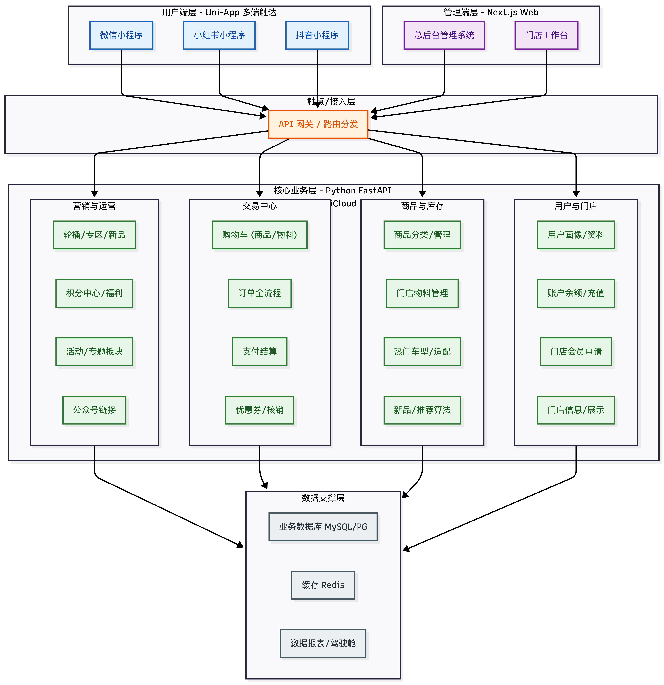

# 汽车用品之家（CarYouPe）架构设计文档

## 1. 整体业务架构图 (Business Architecture)

本架构图展示了业务的层级划分，从用户触达点到核心业务模块，再到数据支撑。

## 2. 整体技术架构图 (Technical Architecture)

本架构图重点体现技术栈的选型和数据流向，特别是 UniCloud 与 FastAPI 的协同工作。

## 3. 架构设计说明

### 3.1 用户端 (Uni-App + UniCloud)

- **多端适配**：使用 Uni-App 一套代码编译发布到微信、小红书、抖音小程序。
- **UniCloud 角色**：作为 BFF (Backend for Frontend) 层或轻量级网关。它非常适合处理小程序特有的登录鉴权（如 `uni-id`）、云存储上传凭证获取、以及支付回调的初步处理。它可以将复杂的业务请求转发给 Python FastAPI，或者直接处理轻量级读请求。

### 3.2 管理端 (Next.js + Shadcn UI)

- **技术选型**：Next.js 提供了优秀的 SSR/SSG 能力和开发体验，Shadcn UI 提供了现代化、高颜值的组件库，非常适合构建美观的后台系统。
- **交互方式**：管理端通常直接通过 RESTful API 与 Python FastAPI 后端交互。

### 3.3 核心后端 (Python FastAPI)

- **定位**：作为整个系统的“大脑”。处理复杂的订单逻辑、库存扣减、商品与车型的匹配关系（多对多关系）、数据分析等。
- **优势**：Python 生态丰富，未来如果要加入 AI 推荐（如根据车型推荐配件）或图像识别（识别行驶证）非常方便。

### 3.4 数据层

- **结构化数据**：建议使用 MySQL 或 PostgreSQL 存储订单、用户、商品等核心数据。
- **非结构化数据**：图片、视频使用云对象存储（OSS）。
- **缓存**：Redis 用于缓存轮播图、热门商品、用户 Session，提高响应速度。
