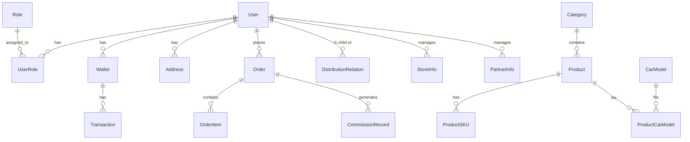

# 数据库设计文档 (Database Schema)

## 1. 概述
本项目采用关系型数据库 (MySQL/PostgreSQL) 存储核心业务数据。以下设计涵盖了用户、商品、订单、分销、钱包等核心模块。

## 2. ER 图 (Entity-Relationship Diagram)

## 3. 详细表结构设计

### 3.1 用户与权限 (Users & Auth)

#### `users` (用户表)
| 字段名 | 类型 | 说明 |
| :--- | :--- | :--- |
| id | BIGINT | 主键 |
| username | VARCHAR | 用户名 |
| phone | VARCHAR | 手机号 (唯一, 绑定) |
| openid_wechat | VARCHAR | 微信 OpenID |
| nickname | VARCHAR | 昵称 |
| avatar_url | VARCHAR | 头像 |
| real_name | VARCHAR | 实名认证姓名 |
| id_card | VARCHAR | 身份证号 |
| status | INT | 状态 (1:正常, 0:禁用) |
| created_at | DATETIME | 注册时间 |

#### `roles` (角色表)
| 字段名 | 类型 | 说明 |
| :--- | :--- | :--- |
| id | INT | 主键 |
| name | VARCHAR | 角色名 (admin, partner, store, member) |
| code | VARCHAR | 角色编码 |
| permissions | JSON | 权限列表 |

#### `user_roles` (用户角色关联表)
| 字段名 | 类型 | 说明 |
| :--- | :--- | :--- |
| id | BIGINT | 主键 |
| user_id | BIGINT | 外键 -> users.id |
| role_id | INT | 外键 -> roles.id |
| level | INT | 等级 (如SVIP等级, 合伙人省/市/区代级别) |
| expire_at | DATETIME | 过期时间 (会员有效期) |

### 3.2 车型与商品 (Cars & Products)

#### `car_brands` (汽车品牌)
| 字段名 | 类型 | 说明 |
| :--- | :--- | :--- |
| id | INT | 主键 |
| name | VARCHAR | 品牌名称 (如 宝马) |
| logo | VARCHAR | Logo URL |

#### `car_series` (车系)
| 字段名 | 类型 | 说明 |
| :--- | :--- | :--- |
| id | INT | 主键 |
| brand_id | INT | 外键 -> car_brands.id |
| name | VARCHAR | 车系名称 (如 3系) |

#### `car_models` (车型/年代款)
| 字段名 | 类型 | 说明 |
| :--- | :--- | :--- |
| id | INT | 主键 |
| series_id | INT | 外键 -> car_series.id |
| name | VARCHAR | 车型名称 (如 2023款 325Li M运动套装) |
| year | VARCHAR | 年款 |

#### `products` (商品表)
| 字段名 | 类型 | 说明 |
| :--- | :--- | :--- |
| id | BIGINT | 主键 |
| category_id | INT | 分类ID |
| title | VARCHAR | 商品标题 |
| subtitle | VARCHAR | 副标题 |
| main_image | VARCHAR | 主图 |
| detail_images | JSON | 详情图列表 |
| base_price | DECIMAL | 基础价格 |
| supply_price | DECIMAL | 供货价 (针对门店) |
| is_on_sale | BOOLEAN | 是否上架 |

#### `product_skus` (商品规格)
| 字段名 | 类型 | 说明 |
| :--- | :--- | :--- |
| id | BIGINT | 主键 |
| product_id | BIGINT | 外键 -> products.id |
| specs | JSON | 规格属性 (颜色:红, 材质:皮革) |
| price | DECIMAL | 售价 |
| stock | INT | 库存 |

#### `product_car_compatibility` (商品车型匹配表)
| 字段名 | 类型 | 说明 |
| :--- | :--- | :--- |
| id | BIGINT | 主键 |
| product_id | BIGINT | 外键 -> products.id |
| car_model_id | INT | 外键 -> car_models.id |
| is_universal | BOOLEAN | 是否通用 (若为True则忽略car_model_id) |

### 3.3 订单与交易 (Orders & Transactions)

#### `orders` (订单表)
| 字段名 | 类型 | 说明 |
| :--- | :--- | :--- |
| id | BIGINT | 主键 |
| order_no | VARCHAR | 订单号 (唯一) |
| user_id | BIGINT | 下单用户 |
| total_amount | DECIMAL | 总金额 |
| pay_amount | DECIMAL | 实付金额 |
| status | INT | 状态 (待支付, 待发货, 待收货, 完成, 取消) |
| address_snapshot | JSON | 收货地址快照 |
| pay_time | DATETIME | 支付时间 |

#### `order_items` (订单明细)
| 字段名 | 类型 | 说明 |
| :--- | :--- | :--- |
| id | BIGINT | 主键 |
| order_id | BIGINT | 外键 -> orders.id |
| product_id | BIGINT | 商品ID |
| sku_id | BIGINT | SKUID |
| quantity | INT | 数量 |
| price | DECIMAL | 购买时单价 |

### 3.4 分销与钱包 (Distribution & Wallet)

#### `distribution_relations` (分销关系链)
| 字段名 | 类型 | 说明 |
| :--- | :--- | :--- |
| id | BIGINT | 主键 |
| user_id | BIGINT | 下级用户ID |
| parent_id | BIGINT | 上级用户ID |
| path | VARCHAR | 关系路径 (如 /1/5/10/)，便于查询整条链路 |
| bind_time | DATETIME | 绑定时间 |

#### `commission_records` (分佣记录)
| 字段名 | 类型 | 说明 |
| :--- | :--- | :--- |
| id | BIGINT | 主键 |
| order_id | BIGINT | 关联订单 |
| order_item_id | BIGINT | 关联明细 |
| beneficiary_id | BIGINT | 受益人ID (获得佣金的人) |
| source_user_id | BIGINT | 贡献人ID (下单的人) |
| amount | DECIMAL | 佣金金额 |
| status | INT | 状态 (预计, 已到账, 已失效) |
| level_snapshot | VARCHAR | 当时等级快照 |

#### `wallets` (用户钱包)
| 字段名 | 类型 | 说明 |
| :--- | :--- | :--- |
| id | BIGINT | 主键 |
| user_id | BIGINT | 用户ID |
| balance | DECIMAL | 现金余额 |
| points | INT | 积分余额 |
| total_income | DECIMAL | 总收益 |

#### `wallet_transactions` (钱包流水)
| 字段名 | 类型 | 说明 |
| :--- | :--- | :--- |
| id | BIGINT | 主键 |
| wallet_id | BIGINT | 钱包ID |
| type | VARCHAR | 类型 (commission_income, withdraw, consume) |
| amount | DECIMAL | 变动金额/积分 |
| related_id | BIGINT | 关联ID (订单号或提现记录ID) |
| direction | INT | 方向 (1:入账, -1:出账) |

### 3.5 门店与合伙人信息

#### `store_infos` (门店扩展信息)
| 字段名 | 类型 | 说明 |
| :--- | :--- | :--- |
| user_id | BIGINT | 关联用户 |
| store_name | VARCHAR | 门店名称 |
| address | VARCHAR | 地址 |
| location | POINT | 经纬度 |
| license_img | VARCHAR | 营业执照 |

#### `partner_infos` (合伙人扩展信息)
| 字段名 | 类型 | 说明 |
| :--- | :--- | :--- |
| user_id | BIGINT | 关联用户 |
| region_code | VARCHAR | 负责区域编码 (省/市/区) |
| level | INT | 代理级别 (省/市/区) |
